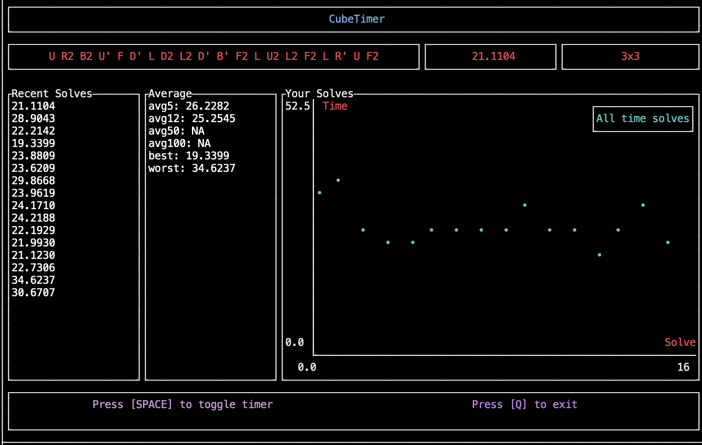

# Cube Timer
A tui-based Rubik's cube timer written in _Rust_.




#### Instructions (pre-release)

```sh
git clone https://github.com/paarthmadan/cube && cd cube
cargo install --path .
cube
```

1. Press <kbd>Space</kbd> to begin and end a solve
2. Press <kbd>q</kbd> to exit the process

Still heavily in development – proper build and release instructions will be added shortly.

#### Feature List

- [x] Timer
- [x] Basic TUI
- [x] Scramble generator
- [x] Statistics
- [x] Solve graph
- [x] Persisting data across sessions (data written to `~/.cube/data.json`)

#### Not yet implemented
- [ ] Minimizing CPU usage
- [ ] Toggling between different cube sessions
- [ ] Custom configuration (colours etc.)
- [ ] Optimizing UI for different frame sizes (right now it's ideally used in a small tmux pane off to the side :/)

#### How does it work?
- Built on top of the [tui-rs](https://github.com/fdehau) crate.
- The process itself is really a glorified timer:
  - There are a few threads:
    - Keyboard Input
    - Redraw Interrupt Dispatcher
- Communication between threads uses basic message passing – Rust has a nice paradigm for this called [mpsc](https://doc.rust-lang.org/std/sync/mpsc/).
- The main thread performs blocked-waiting for interrupts (events) spawned by other threads. Starvation isn't an issue because the redraw interrupt is dispatched at a fixed interval.
- The [tick rate for the process is currently set to 50](https://github.com/paarthmadan/cube/blob/master/src/event_handler.rs#L52), which would mean the process exhibits roughly 20FPS, which is sufficient.

#### Motivation
- Practicing Rust
- Applying some of the fundamentals learned from Operating Systems
- Now I don't have to open my browser everytime I feel like cubing
